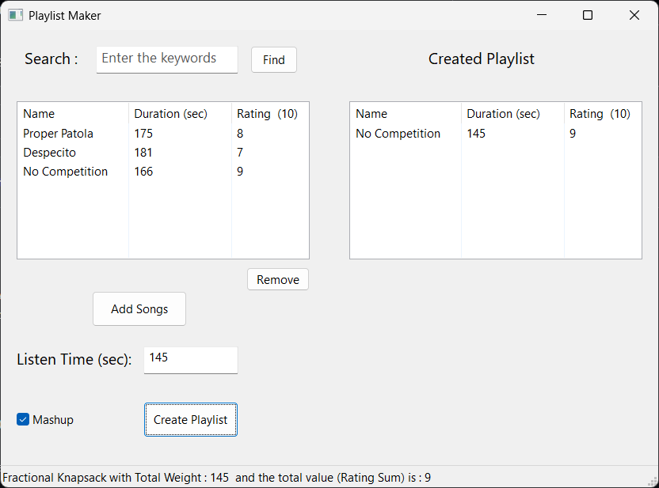

# Music Playlist Builder 
### Abstract :  
This project aims to develop the application “Music Playlist Builder” which will generate the best playlist 
provided the total listen time by the user. This application will choose the music in such a way that you 
will listen to the maximum possible time and such that the Rating of your playlist is maximum from all 
the possible playlist. 
 
### Pre-requisite:    
  - Basic Understanding of C++ 
  - Object Oriented Programming (OOPs)
  - wxWidgets Library for GUI in C++ 
  -  **Algorithms** :  Fractional Knapsack, Binary Knapsack, KMP. 
 
### Problem Statement:  
This work aims to solve the problem of generating the random playlist by adding the songs randomly 
instead of user specified parameter (Total Listen Time) i.e. the total time user wants to listen the music. 

### Looks like:

<!--  -->

 

<!--  -->

